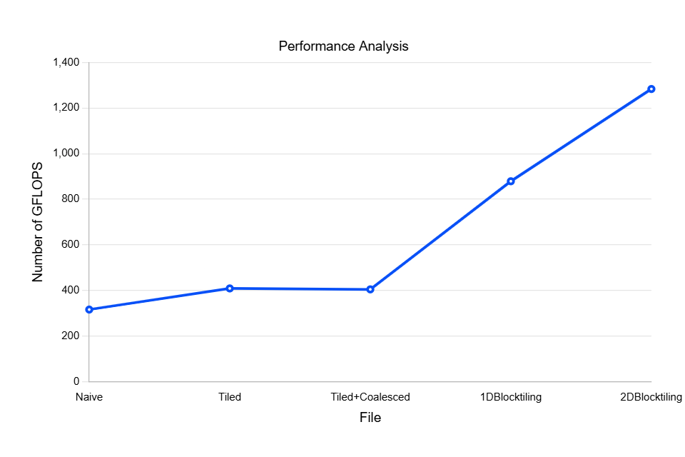

### IMPLEMENTATION DETAILS:

This project measures the differnet optimization techniques for CUDA Matrix Multiplication. 

- Naive: Each thread computes a single element of matrix C (C = A x B). Since the kernel accesses global memory everytime, it causes high latency.

    Key code snippet:

        int j = blockDim.x * blockIdx.x + threadIdx.x;
        int i = blockDim.y * blockIdx.y + threadIdx.y;

        if(i < N && j < N) {
            float C_val = 0.0f;
            for(int k = 0; k < N; k++) {
            C_val += A[i * N + k] * B[k * N + j];
            }
            C[i * N + j] = C_val;
        }

- Tiled: This is the first optimization which uses shared memory. It stores all the elements of A and B in submatrices As and Bs which are stored in shared memory, causing very less latency as compared to global memory.

    Key code snippet:

        __shared__ float As[TILE][TILE];
        __shared__ float Bs[TILE][TILE];

        int threadCol = threadIdx.x;
        int threadRow = threadIdx.y;

        int row = cRow * TILE + threadRow;
        int col = cCol * TILE + threadCol;

        float tmp = 0.0f;

        for (int t = 0; t < N/TILE; t++) {
            int aCol = t * TILE + threadCol;
            int bRow = t * TILE + threadRow;

            As[threadRow][threadCol] = A[row * N + aCol];
            Bs[threadRow][threadCol] = B[bRow * N + col];

            __syncthreads();

            #pragma unroll
            for (int k = 0; k < TILE; ++k) {
                tmp += As[threadRow][k] * Bs[k][threadCol];
            }

            __syncthreads();
        }

    Expected: 2-3x improvement as compared to naive
    Actual: 1.29x, due to memory bank conflicts

- Tiled + Coalesced: Coalescing is the process of the consecutive threads reading consecutive memory addresses. I tried to implement this by transposing the Bs matrix in the shared memory.

    Key code snippet:

        for (int t = 0; t < N/TILE; t++) {
            int aCol = t * TILE + threadCol;
            int bRow = t * TILE + threadRow;

            As[threadRow][threadCol] = A[row * N + aCol];
            Bs[threadCol][threadRow] = B[bRow * N + col];

            __syncthreads();

            #pragma unroll
            for (int k = 0; k < TILE; ++k) {
                tmp += As[threadRow][k] * Bs[threadCol][k];
            }

            __syncthreads();
        }

    Expected: ~3x improvement compared to naive
    Actual: 1.27x, Although the global memory coalescing improved, it didnt do much for the shared memory and we still have one output per thread.

- 1D Blocktiling: A single thread now computes multiple results instead of 1.

    Key Code Snippet:

        float threadResults[TM] = {0.0f};
        for (int i = 0; i < BK; ++i) {
            float bVal = Bs[i * TILE + threadCol];
            for (int j = 0; j < TM; ++j) {
                int aRow = threadRow * TM + j;
                float aVal = As[aRow * BK + i];
                threadResults[j] += aVal * bVal;
            }
        }

    This resulted in a significant increase in performance as we each thread does the work of multiple threads.

    Expected: Significant improvement compared to the previous optimizations
    Actual: 2.78x compared to naive

- 2D Blocktiling: Instead of having one array of results, we calculate a submatrix of C at a time, increasing the data reuse per thread.

    Key Code Snippet:

        float threadResults[TM * TN] = {0.0};
        float regM[TM] = {0.0};
        float regN[TN] = {0.0};

        for (int k = 0; k < BK; ++k) {

            for (int i = 0; i < TM; ++i) {
                regM[i] = As[(threadRow * TM + i) * BK + k];
            }
            for (int i = 0; i < TN; ++i) {
                regN[i] = Bs[k * TILE + threadCol * TN + i];
            }
            for (int i = 0; i < TM; ++i) {
                for (int j = 0; j < TN; ++j) {
                threadResults[i * TN + j] += regM[i] * regN[j];
                }
            }
        }

    Expected: Significant improvement compared to 1D blocktiling
    Actual: 4.05x Naive

Compilation commands:

- Naive :   

            nvcc -O3 -arch=sm_75 naive.cu -o naive
            ./naive

- Tiled :

            nvcc -O3 -arch=sm_75 tiled.cu -o tiled
            ./tiled

- Tiled + Coalesced :

            nvcc -O3 -arch=sm_75 tiled_coalesced.cu -o tiled_coalesced
            ./tiled_coalesced

- 1DBlocktiling :

            nvcc -O3 -arch=sm_75 1DBlocktiling.cu -o 1DBlocktiling
            ./1DBlocktiling

- 2DBlocktiling :

            nvcc -O3 -arch=sm_75 2DBlocktiling.cu -o 2DBlocktiling 
            ./2DBlocktiling 

### PERFORMANCE ANALYSIS:

| Implementation             | Time (ms) | GFLOPS  | % of cuBLAS | Speedup vs Naive |
|----------------------------|-----------|---------|-------------|------------------|
| Naive                      | 6.789696  | 316.276 |   12.213%   | 1.0x             |
| Tiled                      | 5.250886  | 408.975 |   15.791%   | 1.293x           |
| Tiled + Coalesced          | 5.30512   | 404.794 |   15.63%    | 1.279x           |
| 1D Blocktiling             | 2.442988  | 879.039 |   33.942%   | 2.779x           |
| 2D Blocktiling             | 1.672896  | 1283.69 |   49.566%   | 4.058x           |
| cuBLAS                     | 0.8291968 | 2589.84 |     100%    | 8.188x           |

### Diminishing Returns

As optimization levels increase memory bandwidth becomes less of a bottleneck and the improvements taper off unless we use specific techniques like vectorization or wraptiling.

